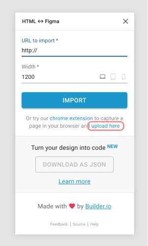

    

# Element to Figma - Browser extension (beta)

Extension to select the page UI elements and download them to later import it to Figma, based on the great job from https://github.com/BuilderIO/html-figma this browser extension allow you to **download the selected pieces on the page instead of all the content** so you can later import those to Figma.

 

## Quick start
* To be able to import the elements into figma you need to install first [HTML <-> Figma](https://www.figma.com/community/plugin/747985167520967365) plugin.
* Download the extension [Chrome store](https://chrome.google.com/webstore/detail/element-to-figma/apadkficecnpmnjmedbpdbkikcofdpim)

## Usage
* Go to the page you want to capture elements
* Click the extension icon and *Enable Selector* 
* Click on the elements you wish to copy to figma

## Manual install
* Download zip in `dist-zip` and manually load on your chrome extension tab. (developer mode need to be enabled) 

## Run locally 
`yarn install`

### Development 
`yarn run watch:dev`

### Generate zip 
`yarn build-zip`

## HTML <-> Figma
In Figma open [HTML <-> Figma](https://www.figma.com/community/plugin/747985167520967365) plugin and click **upload here** then select the json file you want to import. 

